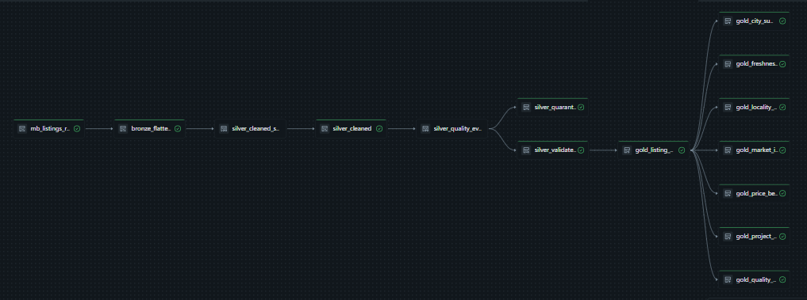
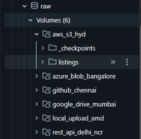

# MagicBricks Real Estate Lakehouse Analytics on Databricks


 


> **End-to-end data engineering project on Azure Databricks** ---
> multi-source ingestion, a streaming Medallion architecture (Bronze →
> Silver → Gold) built with Lakeflow Declarative Pipelines, and
> deployment automated end-to-end with Databricks Asset Bundles (DAB).

------------------------------------------------------------------------

## 📚 Table of Contents

-   [Overview](#overview)
-   [Project at a Glance](#project-at-a-glance)
-   [Architecture](#architecture)
-   [Tech Stack](#tech-stack)
-   [Data Sources](#data-sources)
-   [Project Structure](#project-structure)
-   [Medallion Layers](#medallion-layers)
-   [Databricks Asset Bundle
    Deployment](#databricks-asset-bundle-deployment)
-   [Implementation Guide](#implementation-guide)
-   [Dashboard](#dashboard)
-   [Results](#results)
-   [Skills Demonstrated](#skills-demonstrated)
-   [Future Improvements](#future-improvements)
-   [Author](#author)

------------------------------------------------------------------------

## 📊 Project at a Glance

  Metric                                         Value
  ------------------------- --------------------------
  Cities Covered                                     6
  Ingestion Sources                                  6
  Property Listings                           \~18,000
  Bronze Tables                                      2
  Silver Tables                                      3
  Gold Materialized Views                            8
  Databricks Jobs                                    1
  Lakeflow Pipelines                                 1
  Deployment                  Databricks Asset Bundles

------------------------------------------------------------------------

## ✨ Key Features

-   Multi-source property listing ingestion
-   Streaming Medallion Architecture
-   Databricks Asset Bundles (DAB)
-   Lakeflow Declarative Pipelines
-   Unity Catalog governance
-   Auto Loader streaming ingestion
-   Data quality validation & quarantine
-   Gold Materialized Views
-   Databricks AI/BI dashboards

------------------------------------------------------------------------

## Overview

Residential real-estate listings for six Indian cities are scraped from
MagicBricks and landed through six different ingestion channels (local
upload, GitHub, Google Drive, Azure Blob, AWS S3, and a REST API
upload). From there, a single Lakeflow Declarative Pipeline carries
every record through a Medallion architecture --- Bronze ingestion,
Bronze flattening, Silver cleaning, Silver validation, and eight Gold
materialized views --- governed end-to-end by Unity Catalog.

The whole thing --- catalog/schema/volume setup, external-source
ingestion, and the pipeline itself --- is defined as one Databricks
Asset Bundle and deployed with a single command instead of manual UI
clicks.

**Scale:** \~18,000 listings scraped across the six cities, roughly
3,000 per city.

Highlights:

-   Databricks Asset Bundles (DAB) for config-as-code deployment
-   Lakeflow Declarative Pipelines (streaming tables + materialized
    views)
-   Unity Catalog governance (catalog → schema → volume/table)
-   Auto Loader--based streaming ingestion with schema evolution
-   Databricks Secrets for credential management
-   An explicit multi-task orchestration Job (setup → ingest →
    transform)
-   Eight business-ready Gold materialized views for dashboarding

------------------------------------------------------------------------

## Architecture

``` text
GitHub / Google Drive / Azure Blob / AWS S3 / REST API / Local Upload
                                │
                                ▼
                     Databricks Volumes (raw)
                                │
                                ▼
                 Lakeflow Declarative Pipeline
                                │
   ┌───────────────────────────────────────────────────────────┐
   │ Bronze (raw JSON, Auto Loader)                             │
   │   → Bronze Flattened (one row per listing)                 │
   │   → Silver Cleaned (normalization, typing, parsing)        │
   │   → Silver Validated / Silver Quarantine (business rules)  │
   │   → Gold Materialized Views (dashboard-ready marts)        │
   └───────────────────────────────────────────────────────────┘
                                │
                                ▼
                  Databricks AI/BI Dashboards
```

------------------------------------------------------------------------

## Tech stack

  Category          Technology
  ----------------- -------------------------------------------
  Cloud             Azure Databricks (Unity Catalog--enabled)
  Language          Python, PySpark, SQL
  Governance        Unity Catalog
  Storage           Databricks Volumes
  Processing        Lakeflow Declarative Pipelines
  Streaming         Auto Loader
  Deployment        Databricks Asset Bundles (DAB)
  Orchestration     Databricks Jobs (multi-task DAG)
  Secrets           Databricks Secrets
  Version control   Git & GitHub
  Visualization     Databricks AI/BI Dashboards

------------------------------------------------------------------------

## Data sources

All listing data is scraped on a **local machine** --- there is no cloud
scraping step. What differs per city is where that locally scraped JSON
ends up before the pipeline reads it:

  ----------------------------------------------------------------------------
  City        "Source" in the How the data actually gets there
              pipeline        
  ----------- --------------- ------------------------------------------------
  Ahmedabad   Local upload    Scraped locally, dropped straight into the
                              `local_upload_amd` Volume --- no dispersal

  Delhi NCR   REST API        Scraped locally by `rest_api.py`, saved to disk
                              **and** uploaded directly to the
                              `rest_api_delhi_ncr` Volume via the Files API,
                              in the same run

  Chennai     GitHub          Scraped locally, pushed to a GitHub repo, pulled
                              back down by `01_Data_Ingestion.py` via the
                              GitHub Contents API

  Mumbai      Google Drive    Scraped locally, uploaded to a Google Drive
                              folder, pulled by `01_Data_Ingestion.py` via the
                              Drive API (key in Databricks Secrets)

  Bangalore   Azure Blob      Scraped locally, pushed to ADLS Gen2, copied
              Storage         into the Volume with `dbutils.fs.cp`

  Hyderabad   AWS S3          Scraped locally, pushed to S3, read directly by
                              Auto Loader
  ----------------------------------------------------------------------------

So GitHub, Google Drive, Azure Blob, and S3 are intermediate "drop
points" for locally scraped data, not independent scraping sources ---
Ahmedabad is the only city that skips dispersal entirely, and Delhi NCR
is the only one where the scraper itself pushes straight into a
Databricks Volume instead of an intermediate cloud store.

The Ahmedabad and Delhi NCR scrapers (`Main.py` / `rest_api.py`) run
**locally**, not inside Databricks --- see [Local
scrapers](#local-scrapers-mainpy--rest_apipy) below.

------------------------------------------------------------------------

## Project structure

``` text
magicbricks-real-estate-lakeflow-databricks/
│
├── databricks.yml                          # bundle root config
├── resources/
│   ├── mb_pipeline.yml                     # Lakeflow pipeline resource
│   └── mb_jobs.yml                         # orchestration job (setup → ingest → pipeline)
├── setup/
│   └── 00_Setup_Catalog.py                 # idempotent schema/volume setup
├── 01_Data_Ingestion.py                    # GitHub / Google Drive / Azure Blob ingestion
├── transformations/
│   ├── 02_Bronze_Ingestion.py              # Auto Loader → mb_listings_raw (6 city flows)
│   ├── 03_Bronze_Flattened.py              # explode resultList → one row per listing
│   ├── 04_Silver_Cleaning.py               # null/type/date/URL/address/description cleaning
│   ├── 05_Silver_Expectation.py            # business rules → validated / quarantine
│   └── 06_Gold_Layer_Materialized_Views.py # 8 dashboard-ready Gold marts
├── scripts/
│   ├── Main.py                             # local scraper (Ahmedabad)
│   └── rest_api.py                         # local scraper + Files API upload (Delhi NCR)
└── README.md
```

------------------------------------------------------------------------

## Medallion layers

### Bronze --- `02_Bronze_Ingestion.py`

-   One streaming table, `bronze.mb_listings_raw`, fed by six parallel
    `append_flow`s (one per city), each reading raw JSON text off a
    Volume via Auto Loader.
-   One row = one scraped JSON file, tagged with source file metadata,
    city, source name/type, and ingestion timestamp.
-   Row-level expectations (`raw_json` not empty, `city` present, file
    metadata present) enforced with `expect_all`.

### Bronze Flattened --- `03_Bronze_Flattened.py`

-   Parses the raw JSON against an explicit `StructType` schema and
    explodes `resultList` so that one row = one property listing.
-   Kept amenities / images / landmark details as arrays rather than
    exploding them further, to avoid a cartesian blow-up across
    unrelated nested arrays.

### Silver Cleaning --- `04_Silver_Cleaning.py`

Normalizes \~70 business fields: null standardization, string
trimming/whitespace collapse, categorical casing, integer/timestamp
casting, date parsing (including relative "today"/"yesterday" and
`possession`/`modified` date formats), URL cleanup, address
normalization, HTML stripped from descriptions, and JSON-encoded amenity
arrays parsed and de-duplicated. No rows are dropped here --- every
cleaned Bronze record is preserved.

### Silver Validation --- `05_Silver_Expectation.py`

Applies eleven business rules (valid listing ID, sane price range,
plausible bedroom/bathroom counts, floor-within-building, minimum title
length, valid URL, plausible lat/long, has at least one image, etc.) and
splits records into: - `silver.silver_validated` --- records that pass
every required rule - `silver.silver_quarantine` --- records that fail
one or more, tagged with `failed_expectations` and
`failed_expectation_count`

### Gold --- `06_Gold_Layer_Materialized_Views.py`

`gold_listing_master_current` de-duplicates Silver down to one current
record per `listing_id` (ranked by modified/ingestion/ validation
timestamp) and adds derived business columns --- price per sqft,
carpet-area price, coordinate usability, possession category, listing
source flags, freshness flags, and outlier/benchmark flags. Everything
downstream reads from this table:

  -------------------------------------------------------------------------------
  View                            Purpose
  ------------------------------- -----------------------------------------------
  `gold_listing_master_current`   One current row per listing, business-enriched

  `gold_city_summary`             City-level inventory and pricing rollups

  `gold_locality_summary`         Locality-level inventory and pricing rollups

  `gold_market_inventory`         Segment-level supply breakdown

  `gold_price_benchmark`          Locality/segment price & price-per-sqft
                                  benchmarks, with premium-vs-city and dispersion
                                  metrics

  `gold_project_summary`          Project/society-level inventory and pricing
                                  intelligence

  `gold_freshness_summary`        New/modified/stale listing counts by city &
                                  locality

  `gold_quality_coverage`         Field-completeness and a weighted data-quality
                                  score/band
  -------------------------------------------------------------------------------

------------------------------------------------------------------------

## Databricks Asset Bundle deployment

The project deploys as a single DAB: `databricks.yml` includes the two
resource files under `resources/`, and exposes one variable ---
`catalog` --- that every notebook reads via
`spark.conf.get("catalog", ...)` (or a notebook widget for
`00_Setup_Catalog.py` / `01_Data_Ingestion.py`), so the same bundle can
point at a different catalog per target without editing any notebook.

**`resources/mb_pipeline.yml`** --- declares the Lakeflow pipeline and
its five transformation notebooks (Bronze through Gold), parameterized
by `${var.catalog}`.

**`resources/mb_jobs.yml`** --- declares `mb_end_to_end`, a manually
triggered job with three tasks that run in order:

``` text
setup_catalog  →  ingest_external_sources  →  refresh_medallion_pipeline
```

`setup_catalog` and `ingest_external_sources` run as notebook tasks;
`refresh_medallion_pipeline` triggers the Lakeflow pipeline itself.

### What isn't in the bundle

`scripts/Main.py` and `scripts/rest_api.py` scrape MagicBricks directly
from a laptop, not inside Databricks --- there's nothing for a
Databricks bundle to deploy. They're run manually (or via your own
scheduler) **before** the ingestion job, so the Ahmedabad/Delhi NCR
volumes have data for Auto Loader to pick up.

------------------------------------------------------------------------

## Implementation guide

### 1. Install the Databricks CLI

``` bash
winget install Databricks.DatabricksCLI
databricks -v      # need 0.283.0+
```

### 2. Authenticate

``` bash
databricks auth login --host https://<your-workspace-url>.azuredatabricks.net
```

Accept the default profile name, or give it one (e.g. `mb-dev`). Confirm
it saved correctly:

``` bash
databricks auth profiles
```

### 3. Create the Unity Catalog catalog

Catalog creation is account/metastore-level, so it's intentionally left
outside the bundle as a one-time manual step:

``` sql
CREATE CATALOG IF NOT EXISTS adb_real_estate_mb;
```

### 4. Create the Google Drive secret

`01_Data_Ingestion.py` pulls the Google Drive API key from Databricks
Secrets rather than hardcoding it:

``` bash
databricks secrets create-scope mb_real_estate
databricks secrets put-secret mb_real_estate gdrive_api_key
```

### 5. Configure `databricks.yml`

Set `targets.dev.workspace.host` to your workspace URL and confirm the
default `catalog` variable matches the catalog you created in step 3.

### 6. Validate the bundle

``` bash
databricks bundle validate
```

### 7. Deploy

``` bash
databricks bundle deploy --target dev
```

This uploads the notebooks to your workspace and creates the pipeline
and job. Dev-target deploys are paused by default --- nothing is
auto-scheduled.

### 8. Seed the local-upload / REST API sources

Before running the job, make sure raw JSON is actually sitting in the
volumes it expects:

``` bash
python scripts/Main.py        # Ahmedabad → local_upload_amd volume
python scripts/rest_api.py    # Delhi NCR → uploads via Files API
```

GitHub, Google Drive, Azure Blob, and AWS S3 are pulled live by the job
itself, so they don't need a manual seeding step.

### 9. Run the end-to-end job

``` bash
databricks bundle run mb_end_to_end --target dev
```

Runs `setup_catalog` → `ingest_external_sources` →
`refresh_medallion_pipeline`. The first run takes longer since Bronze
streaming tables and Gold materialized views are being created from
scratch.

### 10. Iterate

Any time a notebook or resource YAML changes:

``` bash
databricks bundle validate
databricks bundle deploy --target dev
```

### 11. Tear down (optional, for cost control)

``` bash
databricks bundle destroy --target dev
```

Deletes the pipeline, job, and any tables/views it manages.

### Adding a prod target

Add a `prod:` block under `targets` in `databricks.yml` with its own
`workspace.host` and `variables.catalog` --- the rest of the bundle
(pipeline, job, notebooks) is already environment-parameterized and
needs no changes.

------------------------------------------------------------------------

## Local scrapers: `Main.py` / `rest_api.py`

Both scripts scrape MagicBricks search-result pages via `curl_cffi`
(Chrome impersonation) through a residential proxy, retry failed pages
up to three times, and log any page that never succeeds to
`failed_pages.txt`.

-   **`Main.py` (Ahmedabad)** saves each scraped page as JSON locally
    only. That local output is then dropped into the `local_upload_amd`
    Volume as a manual step --- it's the one city with no cloud
    dispersal in between.
-   **`rest_api.py` (Delhi NCR)** saves each scraped page as JSON
    locally *and*, in the same run, uploads it straight to the
    `rest_api_delhi_ncr` Databricks Volume via the Files REST API --- so
    the local copy and the Volume copy exist side by side with no
    separate cloud storage hop.

Proxy credentials and the Databricks PAT are left blank in the script on
purpose --- set them as environment variables or a local `.env` file
rather than committing them.

------------------------------------------------------------------------

## Security notes

-   The Google Drive API key lives in Databricks Secrets
    (`mb_real_estate.gdrive_api_key`), never in a notebook.
-   The Databricks PAT and proxy credentials used by the local scrapers
    should be kept out of source control --- set them via environment
    variables rather than editing them into `Main.py` / `rest_api.py`
    directly.
-   `.gitignore` should exclude any local `.env`, credentials file, or
    `databricks.yml` override containing a real workspace host if that
    host is considered sensitive.

------------------------------------------------------------------------

## Future improvements

-   CI/CD via GitHub Actions (`bundle validate` + `bundle deploy` on
    push)
-   Scheduled runs instead of manual trigger (`schedule:` block in
    `mb_jobs.yml`)
-   Incremental/CDC ingestion instead of one-time load
-   Monitoring & alerting on pipeline and Job failures
-   Unit tests for the Silver cleaning/validation logic
-   A `prod` target with its own catalog and workspace

------------------------------------------------------------------------

## Author

**Neel Kalyani** M.Sc. Data Science & Big Data Analytics Systems
Engineer (Data Engineering), Infosys Ltd.

------------------------------------------------------------------------

## 🖼️ Dashboard

> AI/BI:

1.  Listing Explorer

      

2.  Executive Summary

    

3.  City & Locality Summary

   

4.  Inventory Summary

    

5.  Project Intelligence

    

6.  Price Benchmark

    

7.  Freshness

   

8.  Data Quality

    

------------------------------------------------------------------------

## ✅ Results

-   Successfully implemented an end-to-end Databricks Lakehouse project.



-   Successfully deployed infrastructure using Databricks Asset Bundles.


-   Unified six ingestion channels into a single Lakeflow pipeline.



-   Processed approximately 18,000 residential property listings.
-   Built eight Gold Materialized Views for analytics.
-   Implemented automated data quality validation and quarantine.
-   Created reusable deployment configuration for future environments.

------------------------------------------------------------------------

## 💼 Skills Demonstrated

-   Azure Databricks
-   Databricks Asset Bundles (DAB)
-   Lakeflow Declarative Pipelines
-   Unity Catalog
-   Databricks Volumes
-   Auto Loader
-   Delta Lake
-   Streaming ETL
-   PySpark
-   SQL
-   Data Quality Engineering
-   Materialized Views
-   Git & GitHub
-   Cloud Data Engineering

------------------------------------------------------------------------

## 📄 License

This project is provided for educational and portfolio purposes.
